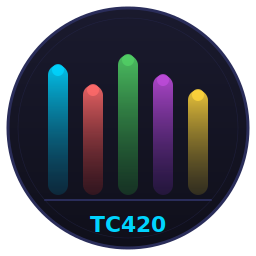

# TC420 Controller

<p align="center">
  
</p>

<p align="center">
  <strong>Application GUI moderne pour contrôler les appareils TC420 LED sous Linux / Ubuntu</strong>
</p>

<p align="center">
  <a href="#fonctionnalités">Fonctionnalités</a> •
  <a href="#installation">Installation</a> •
  <a href="#développement">Développement</a> •
  <a href="#construction-du-deb">Construction du .deb</a> •
  <a href="#utilisation">Utilisation</a> •
  <a href="#licence">Licence</a>
</p>

---

## À propos

**TC420 Controller** est une alternative open-source au logiciel Windows PLED fourni avec les contrôleurs LED TC420. L'application offre une interface graphique premium avec un thème sombre, conçue spécifiquement pour **Ubuntu/Linux**.

Le TC420 est un contrôleur LED USB programmable à 5 canaux, principalement utilisé pour l'éclairage d'aquariums, la culture de plantes, et tout projet d'automatisation LED.

## Fonctionnalités

- 🎨 **Éditeur de timeline 24h** — Interface visuelle avec courbes colorées, points glissables et interpolation lisse
- 📊 **5 canaux indépendants** — Chaque canal a sa propre couleur (Aqua, Coral, Lime, Violet, Or)
- 🔄 **4 modes programmables** — Comme le logiciel original TC420App
- 🎚️ **Contrôle manuel** — Sliders pour ajuster la luminosité en temps réel
- 💾 **Sauvegarde/Chargement** — Programmes exportés en `.tc420` (JSON)
- 🔌 **Connexion USB** — Communication HID directe avec le TC420
- 🌙 **Mode simulation** — Fonctionne sans matériel connecté pour tester et préparer des programmes
- 🖥️ **Thème sombre premium** — Interface moderne avec glassmorphisme et micro-animations
- ⏱️ **Synchronisation horaire** — Sync l'horloge du TC420 avec votre PC

## Captures d'écran

> _L'application se lance avec un thème sombre premium, un éditeur de timeline 24h au centre, le panneau de connexion à gauche, et les contrôles manuels en bas._

## Installation

### Depuis le .deb (recommandé)

Téléchargez le fichier `.deb` depuis la page [Releases](../../releases) :

```bash
sudo dpkg -i tc420-controller_1.0_amd64.deb
```

Après l'installation, l'application apparaît dans le menu **Applications** ou lancez-la avec :

```bash
tc420-controller
```

### Désinstallation

```bash
sudo apt remove tc420-controller
```

## Développement

### Prérequis

- Python 3.10+
- PyQt6
- libusb

### Mise en place

```bash
# Cloner le dépôt
git clone https://github.com/VOTRE_USER/tc420-controller.git
cd tc420-controller

# Créer un environnement virtuel
python3 -m venv .venv
source .venv/bin/activate

# Installer les dépendances
pip install -r requirements.txt

# Lancer l'application
python3 main.py
```

### Structure du projet

```
TC420 Controller/
├── main.py                          # Point d'entrée
├── requirements.txt                 # Dépendances Python
├── build_deb.sh                     # Script de construction du .deb
├── setup_udev.sh                    # Installation des règles udev
├── tc420-controller.desktop         # Fichier .desktop pour le menu
├── assets/
│   └── icons/
│       └── tc420-controller.svg     # Icône de l'application
├── src/
│   ├── app.py                       # Configuration QApplication + thème
│   ├── main_window.py               # Fenêtre principale
│   ├── device_manager.py            # Communication USB HID
│   ├── models.py                    # Modèles de données
│   ├── widgets/
│   │   ├── timeline_editor.py       # Éditeur de timeline 24h
│   │   ├── channel_controls.py      # Sliders de contrôle manuel
│   │   ├── connection_panel.py      # Panneau de connexion
│   │   └── toolbar.py               # Barre d'outils + sélecteur de mode
│   └── utils/
│       ├── file_io.py               # Sauvegarde/chargement fichiers
│       └── theme.py                 # Thème sombre CSS
└── .github/
    └── workflows/
        └── build.yml                # GitHub Actions CI/CD
```

## Construction du .deb

Le script `build_deb.sh` utilise **PyInstaller** pour créer un exécutable standalone, puis le package dans un `.deb` :

```bash
# Depuis le virtualenv
source .venv/bin/activate
pip install pyinstaller

# Construire le .deb
bash build_deb.sh
```

Le fichier `.deb` se trouve dans `dist/tc420-controller_1.0_amd64.deb`.

### Contenu du package .deb

| Composant | Emplacement |
|-----------|-------------|
| Exécutable | `/opt/tc420-controller/` |
| Lanceur | `/usr/bin/tc420-controller` |
| Entrée .desktop | `/usr/share/applications/` |
| Icône SVG | `/usr/share/icons/hicolor/scalable/apps/` |
| Règles udev | `/etc/udev/rules.d/99-tc420.rules` |

## Utilisation

### Éditeur de timeline

- **Clic gauche** sur la timeline : ajouter un point de contrôle
- **Glisser** un point : modifier l'heure et la luminosité
- **Clic droit** sur un point : supprimer
- Cliquer sur un **canal** dans la barre du bas pour le sélectionner

### Connexion USB

1. Branchez votre TC420 en USB
2. Cliquez sur **Connecter** dans le panneau de gauche
3. Si aucun TC420 n'est détecté, le **mode simulation** s'active automatiquement

### Configuration USB (première utilisation)

Si le TC420 n'est pas détecté, configurez les permissions USB :

```bash
sudo bash setup_udev.sh
```

Ou manuellement :

```bash
# Ajouter la règle udev
sudo cp /etc/udev/rules.d/99-tc420.rules /etc/udev/rules.d/
sudo udevadm control --reload-rules

# Ajouter votre utilisateur au groupe plugdev
sudo adduser $USER plugdev

# Redémarrer la session
```

### Formats de fichiers

Les programmes sont sauvegardés en `.tc420` (JSON). Exemple :

```json
{
  "version": "1.0",
  "app": "TC420 Controller",
  "modes": [
    {
      "name": "Aquarium Jour",
      "channels": [
        {
          "name": "Channel 1",
          "points": [
            {"time_minutes": 0, "brightness": 0},
            {"time_minutes": 420, "brightness": 30},
            {"time_minutes": 720, "brightness": 100}
          ]
        }
      ]
    }
  ]
}
```

## GitHub Actions CI/CD

Le workflow GitHub Actions dans `.github/workflows/build.yml` :

- 🔍 **Lint** le code Python
- 🧪 **Tests** des modèles et de la sérialisation
- 📦 **Build** le package `.deb` automatiquement
- 📤 **Upload** le `.deb` comme artefact à chaque push
- 🏷️ **Release** automatique lors de la création d'un tag

## Technologies

- **Python 3.13** — Langage principal
- **PyQt6** — Framework GUI natif
- **pyusb** — Communication USB HID
- **PyInstaller** — Packaging en exécutable standalone
- **dpkg-deb** — Construction du package .deb

## Contribuer

Les contributions sont les bienvenues ! N'hésitez pas à :

1. Fork le projet
2. Créer une branche (`git checkout -b feature/ma-fonctionnalite`)
3. Commit (`git commit -m 'Ajout de ma fonctionnalité'`)
4. Push (`git push origin feature/ma-fonctionnalite`)
5. Ouvrir une Pull Request

## Licence

Ce projet est sous licence **GPL-3.0**. Voir le fichier [LICENSE](LICENSE) pour plus de détails.

---

<p align="center">
  Fait avec ❤️ pour la communauté aquariophile et LED
</p>
